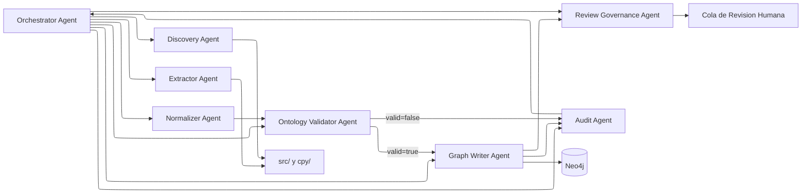
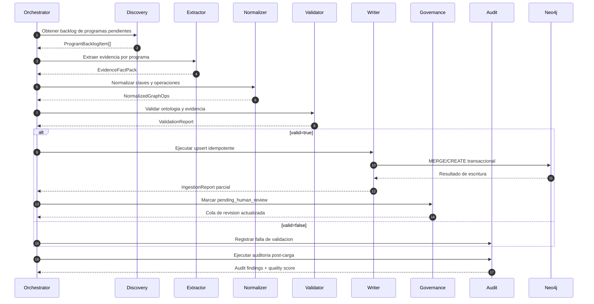
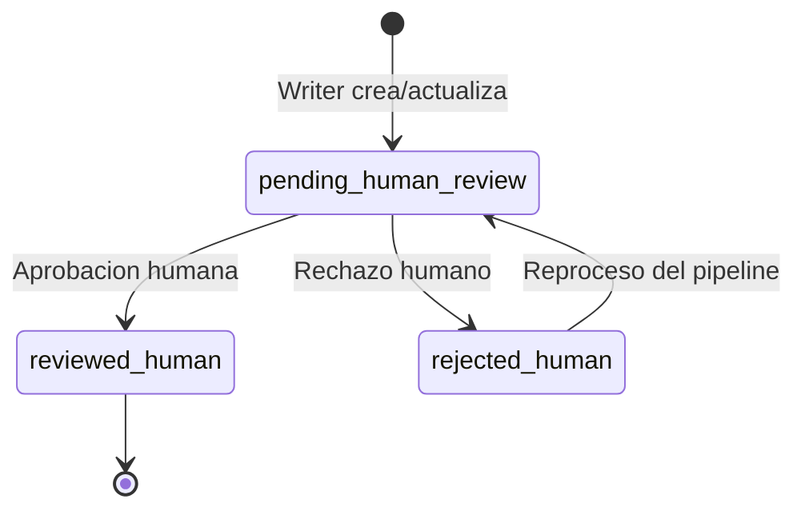
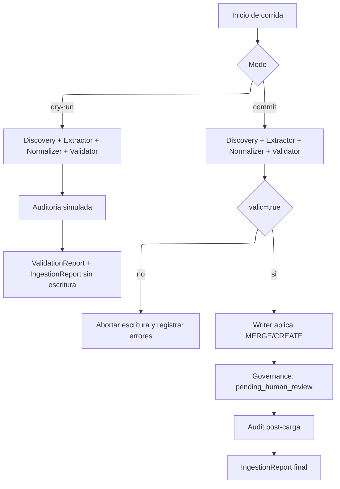

# Blueprint del Sistema Agéntico para Ingesta COBOL en Neo4j

> Referencia operativa para implementar un pipeline agéntico **evidence-first** con **validación estricta**, **idempotencia** y **gobernanza humana**.

## 1. Propósito

Definir una arquitectura agéntica precisa, reproducible y auditable para analizar automáticamente programas COBOL pendientes, extraer evidencia verificable y construir/actualizar el grafo de conocimiento en Neo4j sin invenciones y sin duplicados.

El sistema debe:
- Detectar programas no modelados
- Extraer hechos con evidencia (archivo y líneas)
- Aplicar contrato ontológico
- Hacer upsert idempotente
- Someter resultados a gobernanza de revisión humana
- Mantener trazabilidad completa por ejecución

**Resultado esperado**: cada corrida deja un subgrafo trazable y apto para revisión.

---

## 2. Alcance

Incluye:
- Programas COBOL en src/
- Copybooks en cpy/
- Carga de nodos y relaciones de la ontología vigente
- Flujo de revisión conforme al state machine

No incluye:
- Refactor del código COBOL
- Inferencia semántica no soportada por evidencia
- Creación de tipos/relaciones fuera de la ontología documentada

---

## 3. Principios de Diseño

1. **Evidence-first**: no se crea ningún hecho sin evidencia trazable.
2. **Idempotencia**: re-ejecutar la misma corrida no debe duplicar entidades.
3. **Contratos estrictos**: cada agente entrega un artefacto con esquema fijo.
4. **Validación antes de escritura**: si falla validación, no se escribe.
5. **Gobernanza humana**: todo resultado automático queda en `pending_human_review` con `reviewSource = auto-ingestion`.
6. **Observabilidad**: cada ejecución genera métricas y reporte de calidad.

> Regla de oro: **si no hay evidencia, no hay hecho**.

---

## 4. Arquitectura Lógica

### 4.0 Vista de Componentes



### 4.1 Componentes

1) Orchestrator Agent
- Coordina la corrida end-to-end.
- Selecciona lote de programas pendientes.
- Ejecuta el pipeline por etapas y aplica gates.

2) Discovery Agent
- Compara programas en src/ vs nodos Program en Neo4j.
- Produce backlog priorizado.

3) Extractor Agent
- Analiza COBOL/copybooks.
- Extrae nodos/relaciones candidatas con evidencia.
- No escribe en Neo4j.

4) Normalizer Agent
- Resuelve claves naturales y deduplicación lógica.
- Clasifica operaciones en create, merge, merge-composite.
- Prepara payload de upsert.

5) Ontology Validator Agent
- Verifica etiquetas, relaciones y pares válidos.
- Verifica evidencia obligatoria en relaciones de datos/dependencias.
- Bloquea violaciones.

6) Graph Writer Agent
- Ejecuta transacciones Cypher idempotentes.
- Aplica MERGE para compartidos y MERGE compuesto para Paragraph.
- Añade metadatos de corrida.

7) Review Governance Agent
- Marca nodos/relaciones como pending_human_review con reviewSource auto-ingestion.
- Gestiona estado de revisión y backlog humano.

8) Audit Agent
- Ejecuta controles post-carga: duplicados, huérfanos, cobertura, evidencia.
- Emite score de calidad y reporte por programa.

**Convención transversal**: todo artefacto entre agentes debe incluir `runId` y `programName`.

### 4.2 Flujo de Alto Nivel

1. Discovery identifica programas pendientes.
2. Extractor genera paquete de evidencia por programa.
3. Normalizer transforma a operaciones de grafo.
4. Validator aplica contrato ontológico y reglas de evidencia.
5. Writer ejecuta upsert transaccional en Neo4j.
6. Governance marca pending_human_review.
7. Audit valida salud del subgrafo y emite reporte.
8. Si supera umbrales, queda listo para revisión humana.

**Gate crítico**: `Validator` determina si se continúa a escritura o se bloquea la corrida.



---

## 5. Modelo de Datos Entre Agentes

> Cada contrato debe mantenerse estable y versionado para evitar deriva entre agentes.

## 5.1 Contrato A: ProgramBacklogItem

Campos mínimos:
- `programName`
- `sourceFile`
- `status` (`pending|in_progress|completed|blocked`)
- `priority`
- `discoveredAt`
- `discoveredByRunId`

## 5.2 Contrato B: EvidenceFactPack

Campos mínimos:
- `runId`
- `programName`
- `sourceFile`
- `extractedAt`
- `nodes[]`
- `relationships[]`
- `extractionWarnings[]`

Node fact:
- `label`
- `naturalKey`
- `properties`
- `confidence`

Relationship fact:
- `type`
- `fromNaturalKey`
- `toNaturalKey`
- `properties`
- `evidenceFile`
- `evidenceLines[]`
- `confidence`

## 5.3 Contrato C: NormalizedGraphOps

Campos mínimos:
- `runId`
- `programName`
- `nodeOps[]`
- `relOps[]`
- `dedupDecisions[]`

Node op:
- `opType` (`CREATE|MERGE`)
- `label`
- `key`
- `onCreateSet`
- `onMatchSet`

Rel op:
- `opType` (`MERGE`)
- `fromKey`
- `relType`
- `toKey`
- `setProps`

## 5.4 Contrato D: ValidationReport

Campos mínimos:
- `runId`
- `programName`
- `valid` (`true|false`)
- `errors[]`
- `warnings[]`
- `violatedRules[]`

## 5.5 Contrato E: IngestionReport

Campos mínimos:
- `runId`
- `programName`
- `startedAt`
- `finishedAt`
- `nodesCreated`
- `nodesMatched`
- `relsCreated`
- `relsMatched`
- `qualityScore`
- `auditFindings[]`

---

## 6. Estrategia de Claves e Idempotencia

## 6.1 Claves Naturales

- Program: name
- Paragraph: name
- Copybook: name
- DBTable: name
- ParamType: name
- ExternalRoutine: name
- OutputFile: name

## 6.2 Regla CREATE vs MERGE

Usar MERGE para entidades compartibles:
- `Copybook`
- `DBTable`
- `ParamType`
- `ExternalRoutine`

Usar MERGE por clave natural en entidades contextuales:
- `Paragraph` por `name`

`Program` puede usar `MERGE` por `name` para evitar reingestas duplicadas.

> Recomendación: priorizar `MERGE` en toda entidad con clave natural estable.

## 6.3 Restricciones recomendadas en Neo4j

Definir constraints de unicidad:
- `Program(name)`
- `Copybook(name)`
- `DBTable(name)`
- `ParamType(name)`
- `ExternalRoutine(name)`
- `OutputFile(name)`
- `Paragraph(name)`

---

## 7. Reglas de Validación Obligatorias

1. **Label allowlist**: solo etiquetas aprobadas en ontología.
2. **Relationship allowlist**: solo tipos aprobados.
3. **Pair validation**: origen-destino permitido por tipo de relación.
4. **Evidence required**: `READS_DATA`, `UPDATES_DATA`, `DERIVES_FROM`, `DEPENDS_ON_EXTERNAL`, `USES_COPYBOOK`, `CALLS_ROUTINE` deben llevar `evidenceFile` + `evidenceLines`.
5. **Reachability**: todo nodo debe conectar con su `Program`.
6. **Review defaults**: nodos/relaciones automáticos se crean con `pending_human_review` y `reviewSource = auto-ingestion`.

Si una regla crítica falla, la corrida completa de ese programa queda bloqueada.

**Política de bloqueo**:
- Si `valid=false`, no se escribe en Neo4j.
- La corrida queda en estado `blocked` con su `ValidationReport`.

---

## 8. Gobernanza de Revisión

Estados aplicables:
- `pending_human_review`
- `reviewed_human`
- `rejected_human`

Política propuesta:
1. Writer crea/actualiza con pending_human_review y reviewSource = auto-ingestion.
2. Governance genera cola de revisión humana priorizada por riesgo.
3. Revisor humano marca reviewed_human o rejected_human.
4. Rechazos alimentan mejoras de prompts/reglas del extractor.

Metadatos mínimos:
- `reviewStatus`
- `reviewSource`
- `agentReviewedBy`
- `agentReviewedAt`
- `reviewedBy`
- `reviewedAt`
- `agentReviewNotes`



---

## 9. Orquestación Operativa

## 9.1 Modos de Ejecución

- dry-run: ejecuta hasta ValidationReport y Audit simulado, sin escritura.
- commit: ejecuta escritura y auditoría final.

**Uso recomendado**:
- `dry-run` para pilotos y ajustes de prompts.
- `commit` cuando validación y auditoría estén estables.



## 9.2 Planificador

Frecuencia recomendada:
- Ejecución diaria nocturna para batch
- Ejecución manual on-demand por programa

Tamaño de lote inicial:
- 1 a 3 programas por corrida hasta estabilizar calidad

## 9.3 Política de Reintento

- Error transitorio (conectividad/timeout): 2 reintentos automáticos.
- Error de validación: sin reintento automático, requiere corrección.

---

## 10. Consultas Base de Control

## 10.1 Programas pendientes

```cypher
MATCH (p:Program)
RETURN p.name, p.reviewStatus
ORDER BY p.name;
```

## 10.2 Duplicados por tipo

```cypher
MATCH (n:Copybook)
WITH n.name AS name, count(*) AS c
WHERE c > 1
RETURN 'Copybook' AS type, name, c;

MATCH (n:ParamType)
WITH n.name AS name, count(*) AS c
WHERE c > 1
RETURN 'ParamType' AS type, name, c;

MATCH (n:ExternalRoutine)
WITH n.name AS name, count(*) AS c
WHERE c > 1
RETURN 'ExternalRoutine' AS type, name, c;
```

## 10.3 Relaciones sin evidencia

```cypher
MATCH ()-[r:READS_DATA|UPDATES_DATA|DERIVES_FROM|DEPENDS_ON_EXTERNAL|USES_COPYBOOK|CALLS_ROUTINE]->()
WHERE r.evidenceFile IS NULL OR r.evidenceLines IS NULL OR size(r.evidenceLines)=0
RETURN type(r) AS relType, r;
```

## 10.4 Nodos huérfanos

```cypher
MATCH (n)
WHERE NOT (n)<-[:HAS_PARAGRAPH|INCLUDES_COPYBOOK|READS_TABLE|WRITES_FILE|USES_PARAM_TYPE|CALLS_ROUTINE]-(:Program)
  AND NOT (n:Program)
RETURN labels(n) AS labels, n.name AS name;
```

---

## 11. Observabilidad y KPIs

Métricas por corrida:
- `programasProcesados`
- `porcentajeValidacionExitosa`
- `nodosCreados`
- `nodosReutilizados`
- `relacionesCreadas`
- `relacionesReutilizadas`
- `duplicadosDetectados`
- `hallazgosCriticosAuditoria`
- `tiempoMedioPorPrograma`
- `tasaAprobacionHumana`

SLO inicial sugerido:
- >= 95% corridas sin errores críticos de validación
- 0 duplicados en tipos compartidos
- 100% de relaciones críticas con evidencia

> Objetivo: maximizar calidad sin perder capacidad de procesamiento.

---

## 12. Plan de Implementación por Fases

Fase 1: Fundaciones (1-2 semanas)
- Definir contratos A-E
- Implementar Validator + Audit
- Añadir constraints en Neo4j
- Activar modo dry-run

Fase 2: Ingesta controlada (2-3 semanas)
- Implementar Writer idempotente
- Integrar Governance con pending_human_review
- Procesar 5-10 programas piloto
- Ajustar prompts/reglas de extracción

Fase 3: Escalado (3-4 semanas)
- Automatizar scheduler batch
- Añadir priorización por criticidad
- Publicar dashboard de KPIs
- Estabilizar tasa de aprobación humana

---

## 13. Riesgos y Mitigaciones

Riesgo: Falsos positivos de extracción.
Mitigación: confidence + muestreo humano + reglas más estrictas.

Riesgo: Duplicados por claves incompletas.
Mitigación: constraints + MERGE + auditoría post-carga.

Riesgo: Deriva de ontología.
Mitigación: cambios solo vía proceso formal de contrato.

Riesgo: Saturación de revisión humana.
Mitigación: priorización por impacto y lotes pequeños.

---

## 14. Definición de Hecho (DoD)

Una corrida de programa se considera completada cuando:
1. `ValidationReport.valid = true`
2. Ingesta ejecutada sin errores transaccionales
3. Auditoría post-carga sin hallazgos críticos
4. Nodo `Program` y subgrafo en `pending_human_review`
5. Reporte final emitido con métricas y trazabilidad

---

## 15. Siguiente Paso Recomendado

Implementar un primer piloto sobre 1 programa no modelado usando modo dry-run, medir:
- cobertura de extracción
- errores de validación
- esfuerzo de revisión humana

y luego habilitar commit para ese mismo programa.
