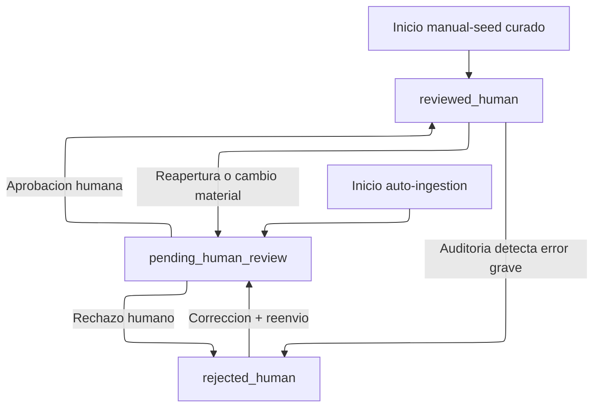

# Maquina de Estados de Revision de Nodos

Guia operativa para el ciclo de calidad de nodos en el grafo.

---

## Objetivo

Esta maquina de estados define como evoluciona un nodo desde su ingesta hasta su aprobacion o rechazo humano, con foco en homogeneidad y trazabilidad.

---

## Metadatos del Nodo

- Nombre: reviewStatus
  Tipo: string
  Uso: Estado actual de revision del nodo.

- Nombre: reviewRequired
  Tipo: boolean
  Uso: Indica si el nodo debe permanecer en backlog de revision.

- Nombre: reviewSource
  Tipo: string
  Uso: Origen del cambio de estado o de la marca de revision.

- Nombre: reviewedBy
  Tipo: string
  Uso: Identificador del revisor humano que tomo la decision final.

- Nombre: reviewedAt
  Tipo: string (fecha)
  Uso: Fecha de la ultima decision humana.

- Nombre: agentReviewedBy
  Tipo: string
  Uso: Identificador del agente que realizo revision tecnica complementaria.

- Nombre: agentReviewedAt
  Tipo: string (fecha)
  Uso: Fecha de cierre de la revision tecnica complementaria.

- Nombre: agentReviewNotes
  Tipo: string
  Uso: Resumen breve de hallazgos tecnicos.

### Valores operativos para reviewSource

- manual-seed
- auto-ingestion
- agent-reviewed

---

## Estados Definidos

| Estado | Significado | Convencion operativa |
|---|---|---|
| pending_human_review | Nodo pendiente de validacion humana | reviewRequired = true |
| reviewed_human | Nodo validado por humano | reviewRequired = false |
| rejected_human | Nodo no conforme, requiere correccion | reviewRequired = true |

---

## Estado Inicial

Depende del origen del nodo:

- Semilla manual curada: reviewed_human
- Ingestion automatizada nueva: pending_human_review
- Nodo historico sin metadatos: fuera de maquina hasta normalizacion

Regla fija para ingesta automatica:

- reviewStatus = pending_human_review
- reviewSource = auto-ingestion

---

## Regla de Completitud Obligatoria

Todos los campos definidos para la tipologia del nodo son imprescindibles.

Si falta al menos uno:

- el nodo se considera incompleto
- el nodo se mantiene en pending_human_review
- el hallazgo debe notificarse en el reporte de calidad

---

## Transiciones Permitidas

- pending_human_review -> reviewed_human
  Evento: aprobacion humana.

- pending_human_review -> rejected_human
  Evento: rechazo humano por inconsistencia o evidencia insuficiente.

- rejected_human -> pending_human_review
  Evento: correccion aplicada y reenvio.

- reviewed_human -> pending_human_review
  Evento: cambio material, reingestion o reapertura por auditoria.

- reviewed_human -> rejected_human
  Evento: auditoria posterior detecta error grave.

---

## Reglas de Consistencia

- Si reviewStatus = reviewed_human, entonces reviewRequired = false.
- Si reviewStatus = pending_human_review, entonces reviewRequired = true.
- Si reviewStatus = rejected_human, entonces reviewRequired = true.
- Si reviewStatus es reviewed_human o rejected_human, deben existir reviewedBy y reviewedAt.

---

## Diagrama de Flujo



---

## Consultas de Control Recomendadas

### 1) Backlog total de revision humana

```cypher
MATCH (n)
WHERE coalesce(n.reviewRequired, false) = true
   OR n.reviewStatus = 'pending_human_review'
RETURN labels(n) AS labels,
       n.name AS id,
       n.reviewStatus AS reviewStatus,
       n.reviewSource AS reviewSource
ORDER BY labels, id;
```

### 2) Distribucion por estado

```cypher
MATCH (n)
WHERE n.reviewStatus IS NOT NULL
RETURN n.reviewStatus AS reviewStatus, count(*) AS total
ORDER BY total DESC;
```

### 3) Nodos con metadatos inconsistentes

```cypher
MATCH (n)
WHERE (n.reviewStatus = 'reviewed_human' AND coalesce(n.reviewRequired, true) = true)
   OR (n.reviewStatus IN ['pending_human_review', 'rejected_human'] AND coalesce(n.reviewRequired, false) = false)
RETURN labels(n) AS labels,
       n.name AS id,
       n.reviewStatus AS reviewStatus,
       n.reviewRequired AS reviewRequired
ORDER BY labels, id;
```

### 4) Nodos incompletos por tipologia

```cypher
MATCH (n)
WITH labels(n)[0] AS label, collect(n) AS nodes
WITH label, nodes,
     reduce(props = [], nd IN nodes | props + [k IN keys(nd) WHERE NOT k IN props]) AS expectedProps
UNWIND nodes AS n
WITH label, n, [p IN expectedProps WHERE n[p] IS NULL] AS missingProps
WHERE size(missingProps) > 0
RETURN label, n.name AS id, missingProps
ORDER BY label, id;
```
